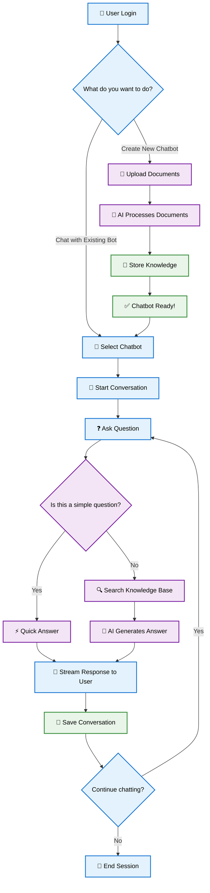
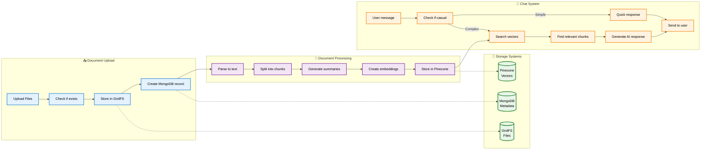

# RAG Chatbot Pipeline Flow Diagram

This diagram shows the main flow of the RAG (Retrieval-Augmented Generation) chatbot system in a simplified, easy-to-understand format.

## Simple Overview Flow

## Detailed Technical Flow

## How It Works (Simple Explanation)

### 🎯 What This System Does
This is a smart chatbot system that lets you upload documents and then chat with an AI that knows everything from those documents.

### 📋 Main Steps

#### 1. **Create Your Chatbot** 🤖
- Upload your documents (PDF, Word, Text files)
- The AI reads and understands them
- Your chatbot is ready to answer questions!

#### 2. **Chat with Your Bot** 💬
- Ask any question about your documents
- Get instant, smart answers
- Continue the conversation naturally

#### 3. **Behind the Scenes** ⚙️
- **GridFS**: Stores your actual files safely
- **MongoDB**: Keeps track of everything (users, chats, document info)
- **Pinecone**: Stores "smart summaries" that help find relevant information quickly

### 🔍 How Questions Get Answered

1. **You ask a question** ❓
2. **System checks**: Is this a simple question (like "hello")?
   - If yes → Quick answer ⚡
   - If no → Search through documents 🔍
3. **Find relevant information** from your uploaded documents
4. **AI generates a smart answer** using the found information 🧠
5. **You get the response** in real-time 📱

### 🎨 Key Features

- **Smart Search**: Finds the right information even if you don't use exact words
- **Real-time Chat**: Responses stream to you instantly
- **Document Memory**: Remembers everything from your uploaded files
- **Conversation History**: Keeps track of your chat history
- **Multi-user**: Different users can have their own chatbots
- **Secure**: Your documents are private and isolated from other users

### 💡 Why It's Useful

- **No more manual searching** through long documents
- **Get precise answers** based on your specific content
- **Natural conversation** interface
- **Always available** 24/7
- **Scales with your needs** - upload more documents anytime

### 🛡️ Technical Highlights

- **Namespace Isolation**: Each chatbot's data is completely separate
- **Smart Caching**: Avoids re-processing duplicate documents
- **Background Processing**: Optional AI enhancement for even better answers
- **Health Monitoring**: System automatically checks everything is working
- **Easy Management**: Simple interface to create, use, and manage chatbots
