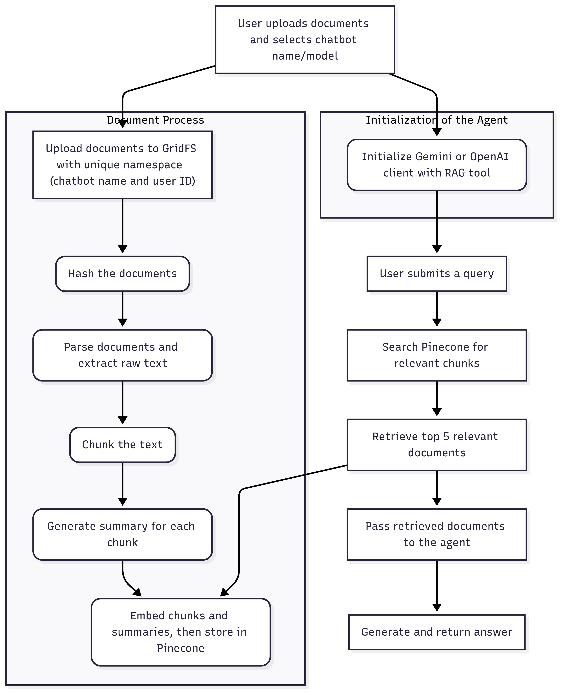

# YOUR-PERSONAL-CHATBOT

YOUR-PERSONAL-CHATBOT is an AI-powered chatbot that helps users search their own documentation using natural language. This project provides a complete pipeline for processing documents, creating embeddings, and interacting with a RAG-based chatbot.

## Features

- **Document Processing:** Upload and process documents from a local directory.
- **Supported File Types:** PDF, DOCX, TXT, and CSV.
- **Chunking Methods:** Choose from various chunking strategies:
    - `token`: Splits text by token count.
    - `line`: Splits text by line count.
    - `recursive`: Splits text recursively by characters.
- **Embedding Models:**
    - **OpenAI:** `text-embedding-3-small`
    - **Gemini:** `gemini-embedding-001`
- **Chatbot Models:**
    - **OpenAI:** `gpt-4.1`, `gpt-4o`, `gpt-4o-mini`, `gpt-o3`
    - **Gemini:** `gemini-2.5-pro`, `gemini-2.5-flash`, and more.
- **Vector Database:** Uses Pinecone for efficient vector storage and retrieval.
- **Database:** MongoDB with GridFS for file storage.
- **CLI Interface:** An interactive command-line interface to manage the entire workflow.

## How It Works

The project follows a master pipeline that orchestrates the entire workflow from document processing to chatbot interaction.

<p align="center">
  
</p>


## Getting Started

### Prerequisites

- Python 3.8 or higher
- Pip for package management
- Access to a MongoDB database
- API keys for OpenAI, Gemini, and Pinecone

### Installation

1.  **Clone the repository:**
    ```bash
    git clone https://github.com/Melitou/YOUR-PERSONAL-CHATBOT.git
    ```

2.  **Create a virtual environment and activate it:**
    ```bash
    python -m venv .venv
    # On Windows
    .venv\Scripts\activate
    # On macOS/Linux
    source .venv/bin/activate
    ```

3.  **Install the required dependencies:**
    ```bash
    pip install -r requirements.txt
    ```

## Usage
Before we start we should download MongoDB locally from https://www.mongodb.com/try/download/community. You choose your version (we recommend 8.0.13 or higher) and platform. When the installation is complete we continue.

Before we start with the main application we should add some clients in our local MongoDB.

```bash
cd backend
python db_service.py
```
This will make a local host in your local MongoDB. 
To add Users or Super Users you will have to run a **curl** command

```bash
curl -X POST "http://localhost:8000/signup" \
  -H "Content-Type: application/json" \
  -d '{
    "user_name": "your_user_name",
    "password": "your_original_password_here",
    "first_name": "your_first_name",
    "last_name": "your_last_name",
    "email": "your_email",
    "role": "User"
  }'
```
We create a User first because in order for the client to use a chatbot he/she needs to have access to it via a User or Super User.


The main entry point for the application is `main.py`. You can run it directly from the command line.

```bash
cd backend
python main.py
```

Now we open another terminal and run the code shown below so that we can initialize the front end:
```bash
cd front_end
npm run dev
```
When the app is ready you will be able to login your user.

These are the following steps to add a Client:
1. You create a chatbot with your own files.
2. Then you click on load existing chatbot and Assign Clients.
3. You then add the email that you want for the client. 

To login as the Client you have to:
1. Logoout of the User.
2. Pass as the username the characters before the @ symbol. For example, if email: example43@gmail.com then Username: example43.
3. The password of the Client will be shown in the terminal of the backend as temporary password.

After logging in you should create a conversation and that is it! Noe you can chat with the chatbot and show the thinking proccess!


## Contributing

Pull requests are welcome. For major changes, please open an issue first to discuss what you would like to change.

Please make sure to update tests as appropriate.

1.  Fork the repository
2.  Create your feature branch (`git checkout -b feature/AmazingFeature`)
3.  Commit your changes (`git commit -m 'Add some AmazingFeature'`)
4.  Push to the branch (`git push origin feature/AmazingFeature`)
5.  Open a Pull Request
